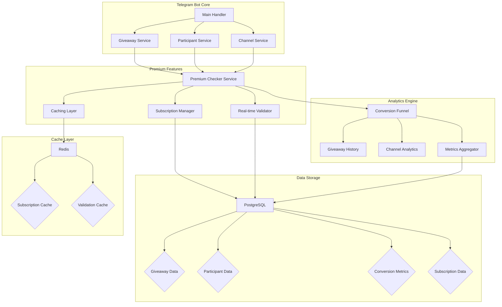

# План архитектуры премиум-функций для бота розыгрышей

## 1. Обзор системы

В этом документе описывается архитектура новых премиум-функций для бота розыгрышей, включая:
- Детализированные отчеты о конверсии участников
- История всех розыгрышей с метриками
- Аналитика по каналам-спонсорам
- Возможность создания большего количества одновременных розыгрышей
- Увеличенное количество каналов-спонсоров
- Автоматическая проверка подписок

## 2. Архитектурные диаграммы

### 2.1. Общая архитектура системы



### 2.2. Структура данных для воронки конверсии

```mermaid
entity Relationship Diagram
    ConversionFunnel ||--o{ Giveaway : tracks
    Giveaway ||--o| GiveawayHistory : generates
    Giveaway ||--o{ GiveawayRequiredChannel : requires
    GiveawayRequiredChannel }o--|| Channel : links
    Channel ||--o| ChannelAnalytics : generates
    User ||--o{ UserSubscription : has
    UserSubscription ||--|| SubscriptionTier : defines
    User ||--o{ Participant : participates
    Participant }o--|| Giveaway : joins
```

### 2.3. Поток данных при участии в розыгрыше с премиум-проверкой


## 3. Подробное описание компонентов

### 3.1. Модели данных

#### ConversionFunnel
Хранит данные о воронке конверсии участников розыгрыша:
- `post_views`: количество просмотров поста
- `unique_clicks`: уникальные клики на кнопку
- `started_join`: количество начавших участие
- `subscribed_all_required`: количество подписавшихся на все каналы
- `fully_participated`: количество полностью завершивших участие
- `avg_time_to_complete`: среднее время прохождения
- `bounce_rate`: процент отвалившихся

#### GiveawayHistory
Архив розыгрышей с агрегированными метриками:
- `total_participants`: общее количество участников
- `new_subscribers`: новые подписчики через розыгрыш
- `avg_tickets_per_user`: среднее количество билетов на пользователя
- `still_subscribed_after_7d/30d`: удержание подписчиков
- `cost_per_participant`: стоимость участника

#### ChannelAnalytics
Аналитика по каналам-спонсорам:
- `new_subscribers_brought`: новые подписчики, которых привел канал
- `avg_conversion`: средняя конверсия
- `retention_7d/30d`: удержание подписчиков
- `failed_checks`: количество неудачных проверок
- `rank_by_conversion/retention`: место в рейтинге

### 3.2. Сервисы

#### PremiumCheckerService
- `get_user_subscription_status()`: получение статуса подписки пользователя
- `batch_check_subscriptions()`: премиум-проверка всех подписок пользователя
- `validate_and_disqualify_participants()`: фоновая проверка участников
- `track_subscription_changes()`: отслеживание изменений подписки

#### Ограничения тарифов
- `max_concurrent_giveaways`: максимальное количество одновременных розыгрышей
- `max_sponsor_channels`: максимальное количество каналов-спонсоров
- `has_realtime_subscription_check`: возможность мгновенной проверки подписки

## 4. Потоки обработки

### 4.1. Создание розыгрыша с учетом тарифа

```
Пользователь -> Запрос на создание розыгрыша
    ↓
Сервис проверки тарифа -> Получает статус подписки
    ↓
Если премиум: разрешает создание до max_concurrent_giveaways
Иначе: проверяет лимит (обычно 1)
    ↓
Создание розыгрыша в базе данных
    ↓
Обновление метрик воронки конверсии
```

### 4.2. Участие в розыгрыше с премиум-проверкой

```
Пользователь -> Нажимает "Участвовать"
    ↓
Премиум-сервис -> Проверяет статус подписки
    ↓
Если премиум: использует кеширование с коротким TTL (1 мин)
Иначе: стандартная проверка с длинным TTL (5 мин)
    ↓
Параллельная проверка подписки на все каналы
    ↓
Обновление статуса участника и метрик воронки
```

## 5. Требования к производительности

- Кеширование результатов проверки подписки для снижения нагрузки на Telegram API
- Параллельные запросы для проверки подписки на несколько каналов
- Фоновые задачи для регулярной проверки подписок участников
- Оптимизация запросов к базе данных с использованием индексов

## 6. Безопасность и надежность

- Использование распределенных блокировок при конкурентном доступе
- Обработка ошибок Telegram API с повторными попытками
- Защита от флуда проверками с помощью Redis
- Логирование всех действий для аудита

## 7. Миграция данных

План миграции существующих данных для поддержки новых функций:
- Перенос существующих пользователей на тарифную систему
- Заполнение исторических данных о розыгрышах
- Создание начальных записей воронки конверсии